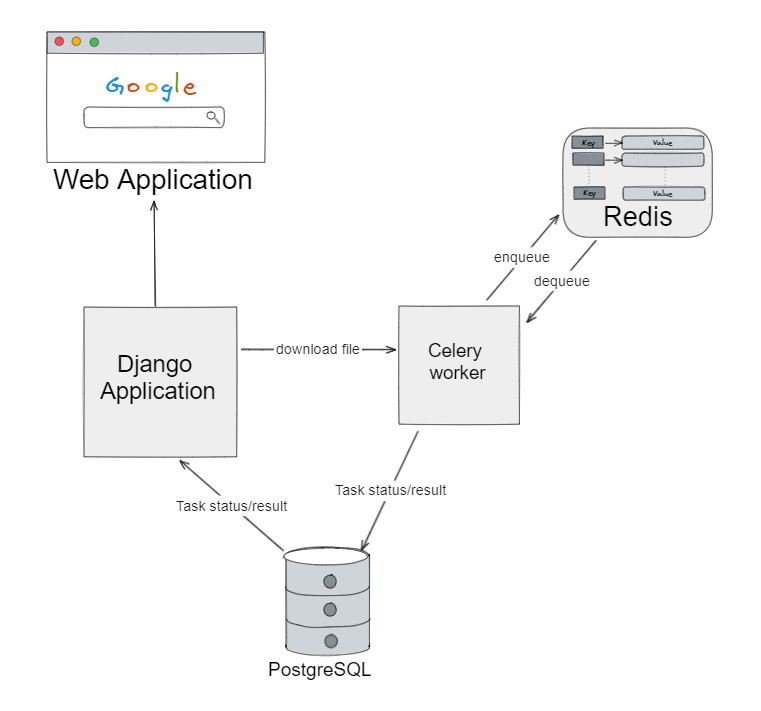

# **DownTube**

This is a Django project that allows users to download audios and videos from YouTube in a secure and controled environment.

## Technologies
The application was made entirely focused on [Django](https://www.djangoproject.com/) and its own structure. Django was used to create the web server and to call different links to download.

For downloading on multi-threading, [Celery](https://docs.celeryq.dev/en/stable/index.html) was used to guarantee a stable and consistent web interface that don't crash because of resource usage.
The Celery Broker used during development was Redis, as it is a simple in-memory database that can reply really fast to celery.

## Solution Architecture


## Requirements
* Python and Pip
* A PostgreSQL instance
* Some Celery broker, like Redis or RabbitMQ.

## Installation

1. Clone the repository:

   ```bash
   git clone https://github.com/hentzrafael/youtube-downloader.git
   ```
2. Install the dependencies:
   ```bash
    cd youtube-downloader
    pip install -r requirements.txt
   ```
3. Create a new file .env on the root directory, following the content of .env.example to connect to a PostgreSQL instance.
   
4. Create a new database named youtube-downloader on your PostgreSQL instance.
   
5. Run the migrations:
    ```bash
    python manage.py migrate
   ```
6. Start the celery Worker:
   ```bash
   celery -A youtube_downloader worker -l info -P solo
   ```
7. Start the server:
    ```bash
    python manage.py runserver
   ```
## Usage
1. Open your browser and go to http://localhost:8000/.
2. Enter the YouTube URL of the video or audio you want to download.
3. Click on the "Download" button.
4. The video or audio will start downloading at the downloads folder inside the repository.

## Contributing
Contributions are welcome! If you find any issues or have any suggestions, please open an issue or submit a pull request.

## Disclaimer
This project does not approves the download of copyrighted content, it has the sole purpose of testing the Django development process and to learn more about Python technologies for web.

## License
This project is licensed under the MIT License - see the LICENSE file for details.

Have fun :) Rafael.